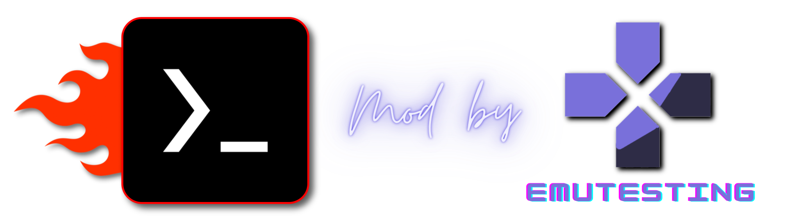

## About
`Termux-box MOD` es simplemente [Termux-box](https://github.com/olegos2/termux-box) pero con varias modificaciones sobre rendimiento y compatibilidades. Tiene las mísmas características: (rootfs preconfigurado con [Box86](https://github.com/ptitSeb/box86), [Box64](https://github.com/ptitSeb/box64), [Wine](https://www.winehq.org/) y [DXVK](https://github.com/doitsujin/dxvk) instalados.)

Está enfocado en el funcionamiento de `Resident Evil 7: Biohazard`, pero en el camino han funcionado otros juegos que no funcionaban, tal como `Gang Beasts`. 

## Installation
Despues de instalado, el comando de inicio es `termux-box`

Requisitos:
[Termux](https://f-droid.org/repo/com.termux_118.apk),
[Termux-X11](https://raw.githubusercontent.com/olegos2/termux-box/main/components/termux-x11-arm64-v8a-debug-latest.apk) para poder usar Turnip dri3.

Abrir Termux y pegar el siguiente comando: 

```
curl -s -o x https://raw.githubusercontent.com/GabiAle97/termux-box/main/install && chmod +x x && ./x
```

Cerca del final de la instalación, será necesario completar una selección geográfica simple. La instalación es lenta, se puede salir de Termux mientras se ejecuta la instalación y luego de un tiempo volver a completar dicha selección, y habrá terminado.

## Configuration

La configuración usada en `Termux-X11` para que se vea todo correctamente en 1280x720 fue:
* `Display resolution mode`: exact
* `Display resolution`: 1280x720
* `Stretch to fit display`: ✅
* `Reseed Screen While Soft Keyboard is open`: ❌
* `PIP Mode`: ❌
* `Fullscreen on device display`: ✅
* `Force Landscape orientation`: ✅
* `Hide display cutout`: ✅
* `Keep Screen On`: ✅
* `Touchscreen input mode`: Trackpad
* `Show stylus click option`: ❌
* `Capture external mouse when possible`: ❌
* `Enable tap-to-move for touchpads`: ❌
* `Show additional keyboard`: ❌
* `Show IME with external keyboard`: ❌
* `Prefer scancodes when possible`: ✅
* `Enable accessibility service for intercepting system shortcuts automatically`: ❌

Despues de terminada la instalación en Termux, tendran disponible un menu, tal como Termux-box original, donde tendran varias opciones de configuración. 
En `preferences`, la configuración probada fue:
* `Resolution`: 1280x720
* `Locale`: es-AR
* `DYNAREC_BIGBLOCK`: 2
* `DYNAREC CONFIGURATION`: Better Performance (4)
* `Cores amount`: 4 (4-7)
* `Run services on startup`: enabled
* `Change box86/box64`: updated build
* `Custom Wine`: Wine-GE-proton-8.13 (opción 2) 

Volver atrás y ejecutar `box64 wine64 with turnip dri3`, luego abrir Termux-X11
Una vez dentro, se instalará automáticamente `VCRedist 2008-2022` y `DotNet Desktop Framework 7.0`. De momento, la instalación no es visual, por lo que hay que revisar en la app `Taskmgr` (`Arranque/Start->Apps->taskmgr`), y ver que haya terminado de correr la instalación de DotNet para saber que ya ha terminado la instalación.
Una vez terminado, en `Arranque/Start->Install` se debe instalar lo siguiente:
* 1 - `dxvk-dev`
* 2 - `Turnip-a7xx-dri3`
* 3 - `mono-gecko`

Hecho esto, ya está completamente configurado este `MOD de Termux-box`. Ante cualquier error o duda, abrir `ISSUES` (cuando estén disponibles), o plantearlas en [Emutesting Discord](https://discord.com/invite/zGnEcUZgtF).
Pueden ver diferentes pruebas en [mi canal de YouTube](https://www.youtube.com/@EmuTesting)

#
Muchísimas Gracias Olegos2 por haber creado [Termux-box](https://github.com/olegos2/termux-box)! Realmente es una herramienta muy potente. 
Y Gracias a los consejos de [MatiasEP](https://github.com/MatiasEP) y Mr. Purple 

## Device support
### Android
* `Android 9+` — muy básico, puede no funcionar
* `Android 10+` — Solo root
* `Android 11+` — root/no-root
### Render
* Snapdragon con Adreno 6xx o Adreno 7xx — Turnip + Zink / Turnip + DXVK con mejor rendimiento.
* Qualcomm/Mediatek/Exynos — VirGL

## Features
* De momento, las updates de `Termux-box` no las pude aplicar en mi mod, pero es en lo que trabajaré ahora.
* TFM funciona mucho mejor con un custom wine.
* Rootfs AHORA NO TAN LIVIANO (4/5GB).
* `Proot`.
* `Chroot`.
* VirGL server con soporte dxtn. Mesa-VirGL 18.3.0, 19.1.8, 22.1.7.
* `Turnip` con soporte de adreno 610 y 7xx. `Mesa-zink-11.06.22` de alexvorxx que es más rápido y tiene mejor compatibilidad. `D8VK + DXVK + VKD3D` y `WineD3D`.
* `Prefix-tweaks` script que instala DirectX, 7-Zip, fixes de registro, mejor taskmgr y notepad. Tema personalizado, mejor fuente y mejores iconos. E:\ (Android/data/com.termux/files/Download) para mejor rendimiento sin tener que usar C:\
* `wine-tweaks` experimental que instala wine automáticamente, lo mejora para tener un mejor rendimiento en TFM y reduce su tamaño
* `zstd`, `gstream` y `winbind` para solucionar algunos errores que impiden que, por ejemplo, RE7 no pase de la pantalla de título.
* Instaladores de `VCRedist desde 2008 a 2022` y `.Net Desktop Framework 7.0` para correcta instalación de EasyAntiCheat (Aún no se pudo probar que funcione correctamente)

## Third party applications

[Box64](https://github.com/ptitSeb/box64) MIT license

[Box86](https://github.com/ptitSeb/box86) MIT license

[Proot](https://github.com/termux/proot) GPL-2.0 license

[DXVK](https://github.com/doitsujin/dxvk) Zlib license

[DXVK-ASYNC](https://github.com/Sporif/dxvk-async)

[DXVK-GPLASYNC](https://gitlab.com/Ph42oN/dxvk-gplasync)

[VKD3D](https://github.com/lutris/vkd3d) LGPL-2.1 license

[D8VK](https://github.com/AlpyneDreams/d8vk) Zlib license

[Termux-app](https://github.com/termux/termux-app) GPLv3 license

[Termux-x11](https://github.com/termux/termux-x11) GPL-3.0 license

[Wine](https://wiki.winehq.org/Licensing)

[Mesa](https://docs.mesa3d.org/license.html) MIT license

[mesa-zink-11.06.22](https://github.com/alexvorxx/mesa-zink-11.06.22)
